# Project 1 README
Project one focuses on finding perfect squares that are sums of consecutive
squares. 
* Pythagorean Identity: 3^2 + 4^2 = 5^2
* Lucas‘ Square Pyramid : 1^2 + 2^2 + ... + 24^2 = 70^2

The Pony programs developed for this project will take user input and determine if there exists any perfect squares that are sums of consecutive squares of a given sequence length and an ending search value. The programs will leverage the Actor model to build a solution that scales well on multi-core machines. 


## Dependencies
Before proceeding, please ensure proper installation of Pony by following the guidelines posted here: https://github.com/ponylang/ponyc

## This directory contains two folders that correspond to different setups for running Project 1.
## 1. Project_One_Non_Remote (The Main Deliverable)
This folder contains the Pony code necessary to run Project 1 on a single machine without a remote server.

### Work-Flow
When the program is started, the following steps occur:

1. **Read Terminal Input**
   - Main actor reads input and spawns a Boss actor.
3. **Boss Actor**
    - Boss Actor divides tasks and spawns Worker Actors
4. **Worker Actors**
    - Worker Actors process tasks
    - Worker Actors send results and finish
5. **Boss Actor Reports Results**
    - Boss Actor collects results from Worker Actors
    - Boss Actor reports the results to the User

### Usage
Navigate to the project directory and run the following command
```
ponyc
```

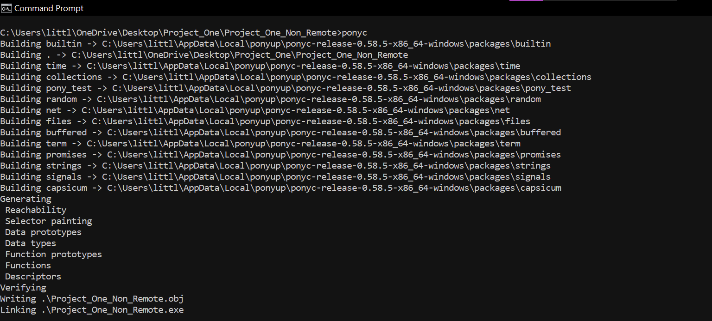


After the pony code has been compiled run the program with the following command:
```
./Project_One_Non_Remote <Ending Value> <Sequence Length>
```

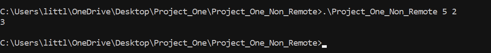


## 2. Project_One_Remote (Bonus Deliverable)
This folder contains the Server and Client Pony code files designed to run Project 1 on two machines.
Two computers are necessary to run this code as intended. 

### Work-Flow
When the Server program is started, the following steps occur:
1. **Main Actor**
   - Main actor starts a TCPListener on port 8999
When the Client program is started, the following steps occur:
1. **Main Actor**
    - Main Actor reads terminal input and attempts to connect to server.
When Connection is established and data is received:
1. **TCPConnectionNotify**
    - Data is received and task is sent to the Main Actor to assign work to Workers .
2. **Main Actor**
    - Divides up the work and spawns Worker Actors.
3. **Worker Actors**
    - Worker Actors process tasks.
    - Worker Actors send results to Client for printing to the user.
    - Workers check in with Main Actor when done with their range of values.
4. **Main Actor Performs Rollcall and Closes Connection**
    - Main Actor ensures everyone has finished and closes the connection to the Client.
After Connection to Client is Closed:
1. **Main Actor**
   - Main actor continues to listen on port 8999 for any additional connections 

### Usage
On the server machine navigate to the Server subdirectory in Project_One_Remote and run the following command
```
ponyc
```

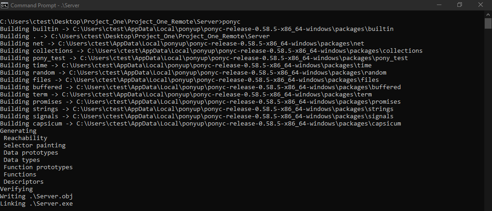


After compliation run the Server by running:
```
./Server
```

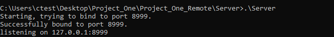


On the client machine navigate to the Client subdirectory in Project_One_Remote and run the following command
```
ponyc
```

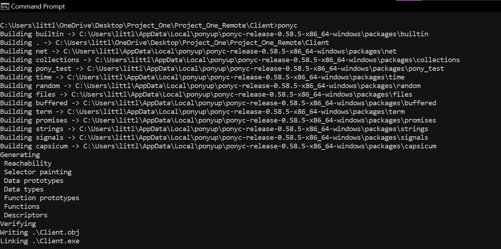


After compliation run the Client by running:
```
./Client <Ending Value> <Sequence Length> <Server IP>
```
For Example:
```
./Client 5 2
```

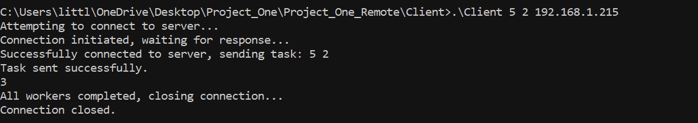


# Performance Analysis
#### Parallel Ratio Formula
The parallel ratio can be calculated using the following formula:
Parallel Ratio = Total CPU time / Real (Wall Clock) Time​

Values over 1 show some degree of parallelism with the larger values having greater extents of parallelism. 

#### 1. The non remote Pony program runs on a single machine and therefore can be analyzed for parallel performance by using the ```time``` command in Linux terminal.
Example:


We can sum the returned ```user``` and ```sys``` times and divide this value by the returned ```real``` time to obtain a ratio.

### 1. Performance Results
I determined that the size of the work unit that results in best performance can be calculated by taking the ending value and dividing that by the number of workers. Each worker will be given a range of consecutive values to caluclate the consecutive sum of squares for. If the worker finds one, they will report it and continue to the next number in their range. 

Due to the nature of how I am assigning the work to the workers, the number of sub-problems is dependent on the input ending value and the number of workers.

Obtaining the run time for ```time ./Project_One_Non_Remote 1000000 4```: (64000 Workers were used - see additional analysis below)
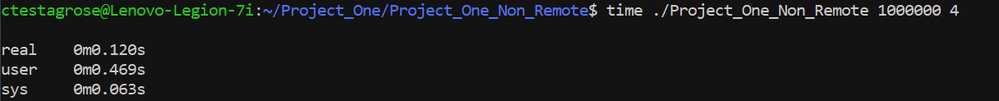
Given the output from the time command we can calculate the CPU time to Real Time ratio
* (0.063 + 0.469) / 0.120 = 4.43
This result shows that effective parallelization is taking place.

We can also increase the problem size and perform ```time ./Project_One_Non_Remote 100000000 20```:
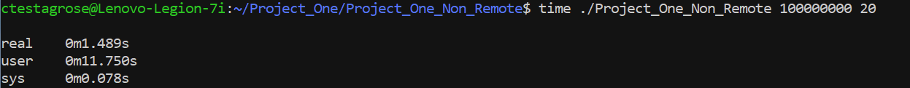
* (0.078 + 11.750) / 1.489 = 7.94

To determine how increasing the problem size and the number of workers, additional analysis was performed. 

Performance was tracked for end values up to 1,000,000,000 and a sequence length of 2 for 64, 640, 6400, and 64000 workers. This analysis was performed using the non remote program to isolate performance of the program from networking latencies. 

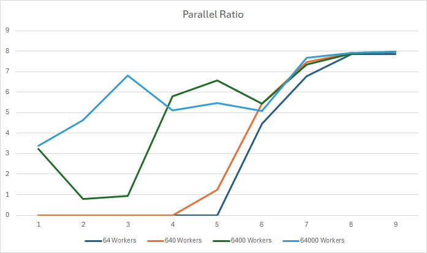
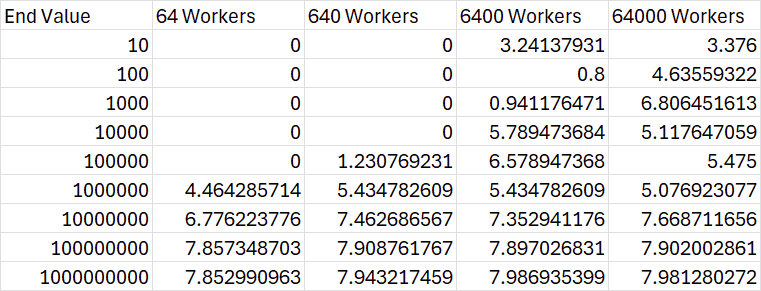

The calculated CPU time to Real Time ratio shows that as the as we increase the number of workers we see that the code is being parallelized more effectively. For very small problem sizes results seem random, implying that there is some overhead involved in parallelizing such a small problem. For large problem sizes we see that for all worker sizes we are achieving effect parallelization of the code. 

#### 2. The Pony program that runs using two computers cannot be accurately timed by running the ```time``` command in Linux terminal. Therefore, in order to time the parallelism of the remote code the "Worker" actors will keep track of their start times and the "Boss" actor will sum the time taken by each worker to determine a total time. The time will be printed on the Server side and not presented to Client.

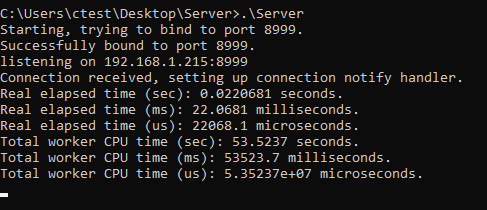

We can divide the ```Total worker CPU time (sec)``` value by the returned ```Real elapsed time (sec)``` to obtain a ratio.

The raw ratios calculated by summing the time spent by each worker and dividing by the real time are displayed in the table below. These values were normalized for visualization purposes in the line chart below. 
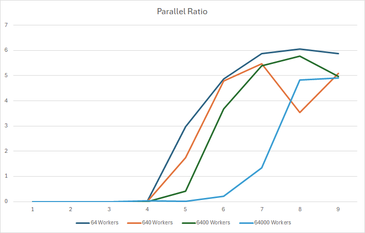
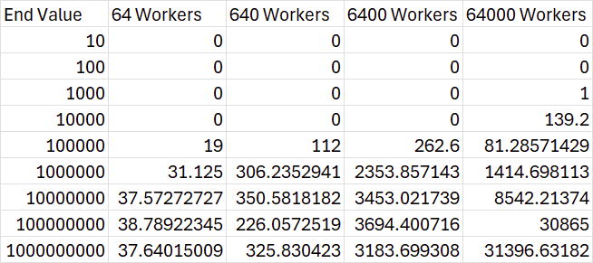

The results for the remote code show similar performance to non remote code with some interesting results for 64000 workers. The parallel ratio appears to be best for 64 workers as it increases as the problem size increases. The adjustments made to the code to make it remote may be to blame for the reduction in the parallel ratio for more workers. Due to being new to Pony, I am certain there are areas of the code that could benefit from optimization or may be causing a slight reduction in the parallel efficiency. 

#### 3. Largest Problems Solved
Below is a collection of screenshots showing some of the largest problems I was able to solve using the non remote code. 

1000000000 2
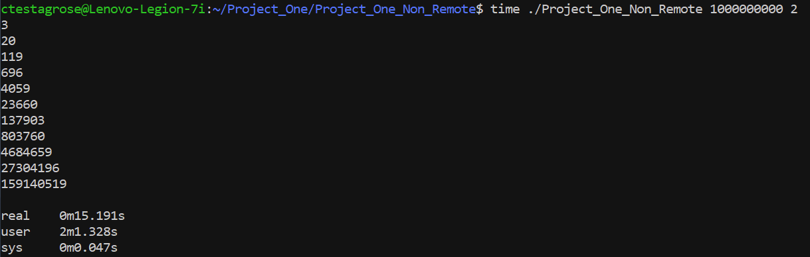

100000000 20
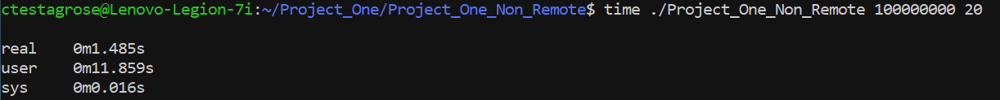

1000000000 4
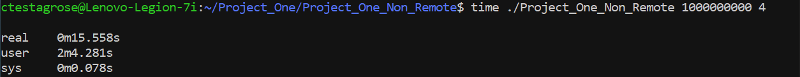

1000000000 10
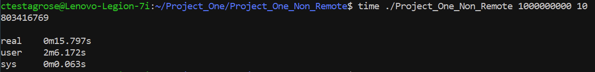

10000000 24
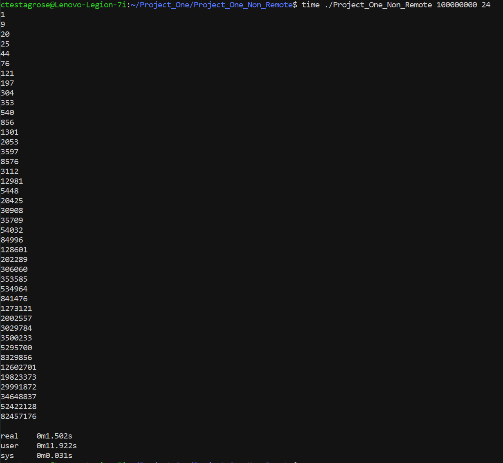

